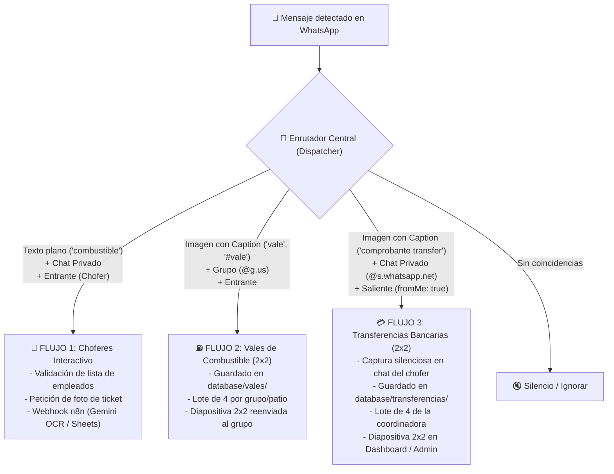

# 📐 Arquitectura Multi-Pipeline: Vales y Transferencias Bancarias
**Rama de Desarrollo:** `feature/multi-pipeline-core`  
**Base de Bifurcación:** `feature/vales-dashboard-auth`  
**Estado:** Documentación y Diseño Técnico (Fase de Pruebas Locales)  
**Fecha:** Septiembre 2026  

---

## 🎯 1. Resumen y Objetivo

Evolucionar el bot de vales de combustible hacia una **plataforma modular multicanal (Multi-Pipeline)** capaz de convivir en una sola base de código con $N$ variantes de captura documental, sin interferir con las operaciones existentes ni generar dependencias complejas de infraestructura.

### Nuevos Requerimientos Clave:
1. **Conservar el flujo actual de Vales de Combustible en Grupos (2x2)**: Entrada desde grupos de patio/estaciones (`@g.us`), acumulación en lotes de 4 vales por grupo y generación de diapositiva enviada de vuelta al grupo.
2. **Incorporar el nuevo flujo de Comprobantes de Transferencias Bancarias (2x2)**: Enviados directamente por las coordinadoras (Cinthia y otras) desde sus cuentas hacia operadores vía chat individual (`@s.whatsapp.net`), detectados como mensajes salientes (`fromMe: true`), acumulados en lotes de 4 por coordinadora y compilados en diapositivas 2x2.
3. **Mantener la compatibilidad con el Flujo Original de Choferes**: Activado por mensaje de texto (`"combustible"`, `"carga"`), con validación en base de datos y envío a n8n para OCR de tickets.
4. **Pruebas 100% Locales**: Validación de lógica, SQLite, Sharp y dashboard sin tocar el VPS de producción ni requerir conexiones en vivo de WhatsApp.

---

## 🧭 2. Topología de los 3 Flujos ("Huella Digital")

Cada mensaje que entra o sale de la sesión de WhatsApp tiene una firma unívoca que permite al bot enrutarlo instantáneamente sin colisiones:



---

## 🗄️ 3. Modelo de Datos SQLite Unificado

Para evitar bloqueos de archivo en disco (`database is locked`) y simplificar los respaldos, se emplea una base de datos local SQLite (`database/records.sqlite`) con soporte WAL (`PRAGMA journal_mode = WAL;`).

### Estructura de Tablas:

```sql
-- Tabla polimórfica de ítems documentales
CREATE TABLE IF NOT EXISTS records (
    id TEXT PRIMARY KEY,
    pipeline_type TEXT NOT NULL,       -- 'VALE' | 'TRANSFERENCIA'
    scope TEXT NOT NULL,               -- 'GROUP' | 'INDIVIDUAL'
    chat_id TEXT NOT NULL,              -- JID del grupo o número del operador
    sender_name TEXT NOT NULL,
    sender_phone TEXT NOT NULL,
    coordinator TEXT,                  -- 'Cinthia', 'Coord2', etc.
    caption TEXT,
    image_path TEXT NOT NULL,
    slide_id TEXT,
    slide_slot INTEGER,                -- 1, 2, 3 o 4 en la cuadrícula
    status TEXT NOT NULL DEFAULT 'pending', -- 'pending' | 'grouped'
    created_at DATETIME DEFAULT CURRENT_TIMESTAMP
);

-- Tabla de diapositivas compiladas (Sharp 2x2)
CREATE TABLE IF NOT EXISTS slides (
    id TEXT PRIMARY KEY,
    pipeline_type TEXT NOT NULL,       -- 'VALE' | 'TRANSFERENCIA'
    title TEXT NOT NULL,               -- Ej. 'Patio Norte' o 'Cinthia - Transferencias'
    image_path TEXT NOT NULL,
    image_url TEXT NOT NULL,
    items_count INTEGER NOT NULL DEFAULT 4,
    created_at DATETIME DEFAULT CURRENT_TIMESTAMP
);

-- Índices para consultas inmediatas
CREATE INDEX IF NOT EXISTS idx_records_type_status ON records(pipeline_type, status);
CREATE INDEX IF NOT EXISTS idx_records_chat ON records(chat_id);
CREATE INDEX IF NOT EXISTS idx_records_slide ON records(slide_id);
```

---

## ⚙️ 4. Configuración Declarativa (`pipelines.config.json`)

Toda la lógica de activación se desacopla del código duro y pasa a un archivo JSON recargable en caliente (*Hot-Reload*):

```json
{
  "pipelines": {
    "vales": {
      "enabled": true,
      "type": "VALE",
      "scope": "group",
      "direction": "incoming",
      "triggerKeywords": ["vale combustible", "vale diesel", "ticket combustible", "#vale", "vale"],
      "batchSize": 4,
      "storagePath": "database/vales",
      "slidesPath": "database/slides_vales",
      "sendSlideToChat": true,
      "footerTitle": "Dleon • Combustible Patio"
    },
    "transferencias": {
      "enabled": true,
      "type": "TRANSFERENCIA",
      "scope": "individual",
      "direction": "outgoing",
      "triggerKeywords": ["comprobante transfer", "comprobante transferencia", "#transferencia", "#spei", "deposito"],
      "batchSize": 4,
      "storagePath": "database/transferencias",
      "slidesPath": "database/slides_transferencias",
      "sendSlideToChat": false,
      "footerTitle": "Dleon • Comprobantes Bancarios"
    }
  }
}
```

---

## 🖼️ 5. Generador Visual Sharp (Hoja Carta 2x2 Minimalista)

Se reutiliza el motor probado de Sharp con hoja carta horizontal (2200 x 1700 px a 200 DPI):
* **Auto-rotación EXIF**: Corrige fotos verticales u horizontales automáticamente.
* **Márgenes y líneas de corte SVG**: Guías punteadas exactamente al centro (`X = 1100`, `Y = 850`) y marcas de corte en los bordes.
* **Pie de página contextual**: Varía según el tipo de pipeline (`"Dleon • [Ubicación/Coordinadora] • [Tipo]"`).
* **Aislamiento estricto de lotes**: Un vale de diesel **nunca** comparte lámina con una transferencia bancaria.

---

## 🧪 6. Plan de Verificación y Pruebas Locales (Sin VPS)

Las pruebas locales se ejecutarán mediante scripts automatizados en Node.js/TypeScript sin requerir conexión a WhatsApp:

1. **Prueba de Ingesta Sintética (`test_multi_pipeline.ts`)**:
   * Generación de 4 tickets de diesel simulados vía SVG + Sharp.
   * Generación de 4 capturas de transferencias bancarias (formato app móvil BBVA/Banorte simulado) vía SVG + Sharp.
2. **Prueba de Enrutamiento y Triggers**:
   * Verificación de discriminación por palabra clave (`#vale` vs `comprobante transfer` vs mensajes comunes).
   * Verificación de contexto (`@g.us` vs `@s.whatsapp.net` y `fromMe: true` vs `fromMe: false`).
3. **Prueba de Aislamiento de Lotes**:
   * Insertar intercaladamente: Vale 1, Transferencia 1, Vale 2, Transferencia 2...
   * Comprobar que al llegar al Vale 4 se genera la lámina de vales sin tocar las transferencias.
   * Comprobar que al llegar a la Transferencia 4 se genera la lámina de transferencias independiente.
4. **Validación Gráfica y Exportación**:
   * Inspección de dimensiones (2200x1700 px), formato PNG y peso de salida.
   * Generación y lectura de CSV independiente para vales y para transferencias.

---

## 🔒 7. Políticas de Git y Despliegue

* **Rama activa:** `feature/multi-pipeline-core`.
* **Commits atómicos:** Solo código nuevo, pruebas y documentación explicada.
* **Regla de oro:** No tocar servidores ni repositorios remotos de producción hasta que la suite de pruebas locales pase al 100% y sea aprobada por el usuario.
